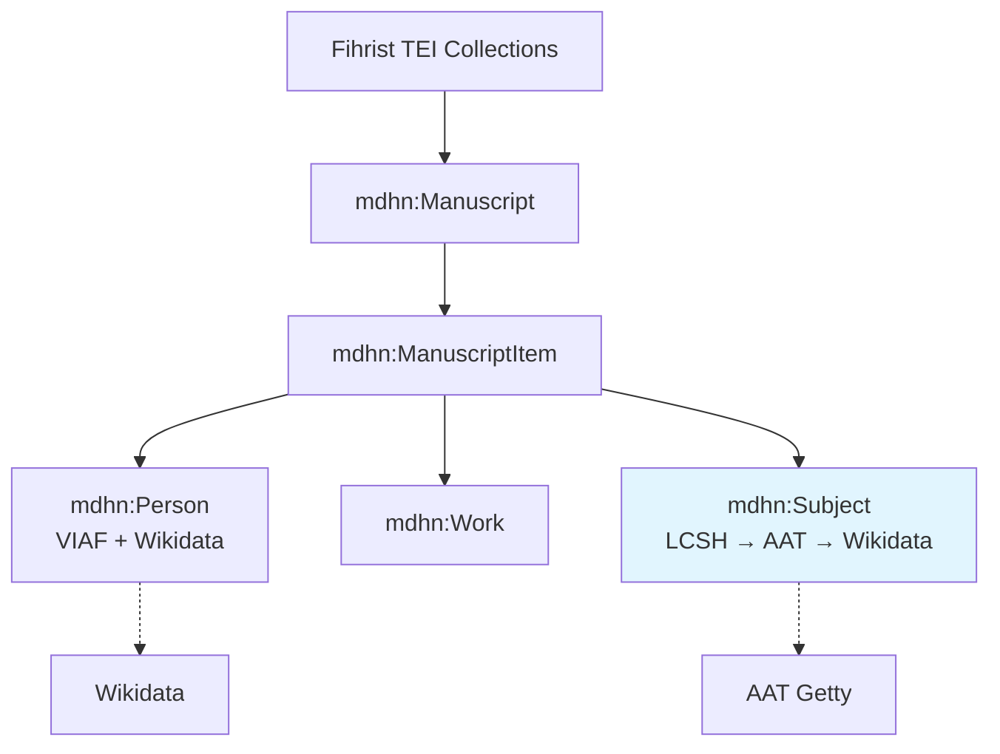

# Fihrist-As-RDF

# Fihrist-As-RDF: Linked Open Data for the Fihrist Union Catalogue of Islamicate Manuscripts
[](https://creativecommons.org/publicdomain/zero/1.0/)
[]()
[]()

**Transforming distributed TEI XML from [fihristorg/fihrist-mss](https://github.com/fihristorg/fihrist-mss) into a richly interconnected Knowledge Graph.**

This project delivers a **minimal yet expandable RDF/OWL ontology**, harvesting pipelines, and reconciled datasets with strong bindings to LC Subjects, AAT, VIAF, and Wikidata.

**Key Focus Areas**:
- **Subjects**: Start with LCSH (already in TEI), map to AAT + Wikidata for robust cultural heritage interoperability.
- **Persons**: Extend existing VIAF mappings with Wikidata.
- **Visualizations**: Mind maps, relationship graphs, and dashboards for intuitive exploration.

**Vision**: A FAIR, queryable hub linking manuscripts, persons, works, and subjects — powering your MLDCH aggregator, IIIFDexir viewers, Shahnameh modeling, and the National Digital Collection.

## Project Structure (Visualization-First)

```
Fihrist-As-RDF/
├── README.md
├── LICENSE
├── ontology/                  # Core + alignments
├── data/
│   ├── samples/               # Pilot RDF + visualizations
│   ├── authorities/           # Reconciled Persons, Subjects, Works
│   └── full-kg/               # Aggregated, versioned dumps
├── processing/                # Scripts & notebooks
├── visualizations/            # High-res diagrams, Mermaid, Graphviz exports
│   ├── mindmaps/
│   ├── relationship-graphs/
│   └── dashboards/            # Example SPARQL → visualization
├── docs/                      # Reports & examples
└── CONTRIBUTING.md
```

**Interactive Overview** (Mermaid in repo):


## Minimal Ontology (First Draft)

**Namespace**: `mdhn:` (`https://MehranDHN.github.io/mdhn-ontology#`)

**Core Classes** (expandable per systematic plan):
- `mdhn:Manuscript` ⊑ `crm:E22_Manifestation`
- `mdhn:ManuscriptItem` ⊑ `frbr:Expression`
- `mdhn:Person` ⊑ `crm:E21_Person`
- `mdhn:Work` ⊑ `frbr:Work`
- `mdhn:Subject` ⊑ `skos:Concept`

**Key Properties**:
- Linking: `mdhn:hasManuscriptItem`, `mdhn:authoredBy` (with roles), `mdhn:referencesWork`, `mdhn:hasSubject`
- Reconciliation: `mdhn:reconciledTo` (object property to external URIs)
- Provenance & IIIF-ready.

**Subjects Module** (Priority):
- Ingest LCSH from TEI `<keywords scheme="#LCSH">` and authority files.
- Mappings: LCSH → AAT (material/cultural terms) → Wikidata (stronger global bindings).
- Example Turtle (in `ontology/mdhn-fihrist.ttl`):

```turtle
mdhn:Subject a owl:Class ;
    rdfs:subClassOf skos:Concept .

<subject_sh85055328> a mdhn:Subject ;
    skos:prefLabel "Glossaries, vocabularies, etc."@en ;
    mdhn:reconciledTo <http://vocab.getty.edu/aat/300000000> ;  # Example AAT
    mdhn:reconciledTo <http://www.wikidata.org/entity/Q...> ;
    skos:exactMatch <http://id.loc.gov/authorities/subjects/sh85055328> .
```

**Persons Module** (Extension):
- Build on existing VIAF in `persons.xml`.
- Add Wikidata reconciliation (e.g., via your pipelines or tools like OpenRefine/KG reconciliation).
- Same pattern for strong bindings.

Full details + diagrams: [ontology/documentation.md](ontology/documentation.md)

## Reconciliation Strategy

- **Persons**: VIAF (existing) + Wikidata (new) — use labels, dates, roles for disambiguation.
- **Subjects**: LCSH base → AAT (for art/archaeology/iconography) → Wikidata (broader links, multilingual).
- Tools: Python (rdflib + SPARQL), OpenRefine, Wikidata API.
- Goal: High-confidence `skos:exactMatch` / `mdhn:reconciledTo` triples.

## Visualizations & Exploration

- **Mind Maps**: Hierarchical views (Manuscript → Items → Entities).
- **Relationship Graphs**: Network of persons-subjects-manuscripts.
- **Dashboards**: SPARQL → Mermaid / GraphDB visualizations.
- Examples in `/visualizations/` (high-resolution PNG/SVG + source).

## Pipeline & Data

(See `processing/` for scripts.)

1. Harvest TEI (ZIP → local folders).
2. Extract & reconcile (LC Subjects first, then Persons).
3. Generate RDF + visualizations.
4. Validate (SHACL) & enrich.

**Samples available** in `data/samples/`.

## Roadmap

- [x] Minimal ontology + Subjects/Person focus
- [ ] Full harvest & LCSH→AAT/Wikidata mappings
- [ ] Advanced visualizations & IIIF integration
- [ ] Community expansion

## Contributing

Prioritize ontology refinements, reconciliation mappings, or visualization improvements. See [CONTRIBUTING.md](CONTRIBUTING.md).

**Contact**: Mehran DHN (@Mehrandhn, Telegram channel)

## Ethics & Acknowledgments

Open, provenance-preserving, culturally sensitive. Built on Fihrist TEI community data. Aligns with FAIR/LOUD and your DCH portfolio.

---

**Next Actions Ready**:
- Full `ontology/mdhn-fihrist.ttl` file (minimal + Subjects/Person patterns).
- Sample LCSH extraction + mapping script.
- High-res Mermaid/Graphviz mind map for Subjects reconciliation.
- `ontology/documentation.md` expansion.
- Or proceed to processing script for LCSH pilot.

This keeps the visualization emphasis strong while prioritizing Subjects (LC → AAT/Wikidata) and extending Persons. Feedback on this draft? What to generate next (Turtle file, script, diagram)?

