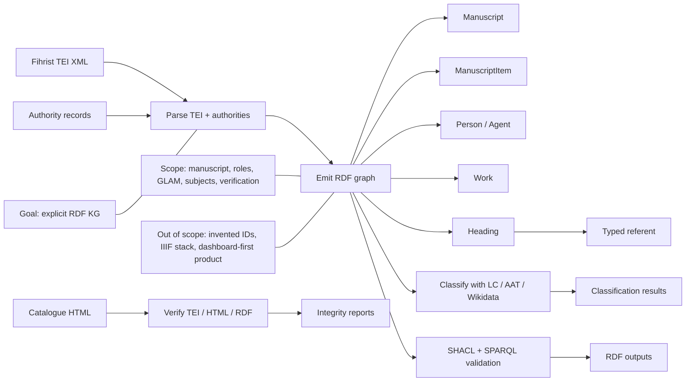

# Fihrist-As-RDF

Rewrite (2026): TEI → explicit RDF knowledge graph, with HTML integrity checks and typed headings.

**Read first:** [docs/SPEC.md](docs/SPEC.md) (contract) and [docs/PROGRESS.md](docs/PROGRESS.md) (method log).

```text
python fihrist.py gold --classify
python fihrist.py harvest --collection "ancient india and iran trust"
python fihrist.py verify --gold
```

Gold records: AIIT Pers 1.01 (`manuscript_11855`), Cambridge Add. 1064 (`manuscript_8976`).  
Reports: `data/reports/`. RDF: `data/rdf/`.


# Fihrist-As-RDF: Linked Open Data for the Fihrist Union Catalogue of Islamicate Manuscripts
[](https://creativecommons.org/publicdomain/zero/1.0/)
[]()
[]()

**Transforming distributed TEI XML from [fihristorg/fihrist-mss](https://github.com/fihristorg/fihrist-mss) into a richly interconnected Ontology-bases Knowledge Graph.**

This project delivers a **minimal yet expandable RDF/OWL ontology**, harvesting pipelines, and reconciled datasets with strong bindings to LC Subjects, AAT, VIAF, and Wikidata.

**Key Focus Areas**:
- **Subjects**: Start with LCSH (already in TEI), map to AAT + Wikidata for robust cultural heritage interoperability.
- **Persons**: Extend existing VIAF mappings with Wikidata.
- **Visualizations**: Mind maps, relationship graphs, and dashboards for intuitive exploration.

**Vision**: A FAIR, queryable hub linking manuscripts, persons, works, and subjects — powering your MLDCH aggregator, Integrating with IIIFDexir.
The goal is 'complete' transformation of the original 'TEI XML' to 'explicit RDF'.

## What “complete, explicit RDF” means here

For every manuscript:

- Holding GLAM and digital-publisher GLAM as distinct links  
- Every person with **role** (MARC relator codes Fihrist already uses: `aut`, `fmo`, `scr`, …)  
- Every subject-like concept, typed when the source allows (LCSH vs LCNAF/place vs other `term`)  
- Work, when `@key` exists  
- Nested `msItem` where the TEI nests items  
- Provenance: which source asserted the triple (TEI / authority / HTML check)

Extendability: SKOS `exactMatch` / `closeMatch` to LC and VIAF **in v1** (already in the files). AAT, Wikidata, genre/technique vocabularies as **the same pattern**, not a second pipeline.

## Verification 

A pipeline stage that:

1. Parses TEI for entities and associations (keys, roles, GLAMs, subjects).  
2. Parses HTML — locally generated catalogue HTML, and/or live `fihrist.org.uk/catalog/{id}` pages for manuscripts **and** person/subject records.  
3. Optionally reads authority comments as a reverse-index snapshot.  
4. Emits an **alignment report**: in TEI not HTML, in HTML not TEI, in comments not TEI, label/role mismatches.  
5. Fails the build if gold records disagree on the associations we care about.  
6. SHACL on the RDF; SPARQL competency questions with expected answers.

That is the “accurate verification mechanism” for associations. Regex-over-comments is not.

## Scope lock 

**In**

- Full corpus under `data/fihrist-mss/collections` + the three authority files  
- Four entities + Work  
- All role-bearing person/org links  
- Both GLAM roles  
- Subjects as a SKOS concept scheme (headings now; technique / narrative / genre as concept **types** or child schemes as data allows)  
- Existing LC/VIAF/ISNI links  
- HTML↔TEI↔RDF verification  
- Ontology (`mdhn:`) with alignments to CIDOC-CRM / FRBR / SKOS, one namespace  
- RDF dump + SHACL + competency questions  

**Out of the first rewrite (unless you pull them in)**

- Invented AAT/Wikidata IDs  
- IIIF viewers, MLDCH aggregator, Shahnameh-specific modelling  
- Dashboards as the primary product  
- Visualization reports as Dot, mermaid and markmap.
- Trusting authority comments as the join 

## What changed in the lock

| | Decision |
|---|---|
| **Reconciliation targets** | LC and VIAF (already in Fihrist) **and** AAT **and** Wikidata, for concepts, persons, and manuscripts. |
| **Wikidata has two jobs** | **This project:** intended to match Fihrist entities to *existing* Wikidata items. **Later project:** mint or enrich Wikidata from Fihrist where items are missing, then map those new items back onto these subjects. This repo must not invent Wikidata Q-ids. |
| **Subjects are not one class** | Keep the original heading as a SKOS concept (fidelity to the catalogue), then **type** it. Spatial, agential, temporal, event, topical, genre/technique are first-class in the ontology. |

## The real problem (confirmed in the files)

Fihrist stores almost everything as `<item xml:id="subject_…"><term type="display">…`. There is no type field.

The same list contains, among others:

- **Spatial:** Ābādān (`n81097924`), Iraq, Afghanistan  
- **Agential:** Abū Yazīd Bisṭāmī (`n82005897`), Abū Bakr as an LCSH (`sh91005311`)  
- **Event:** Afghan Wars  
- **Topical / law / genre:** Ablutions (Islamic law), Accounting—Handbooks, Acrostics  
- **Pre-coordinated blobs:** Afghanistan--History, Islamic Empire--History  

`sh…` vs `n…` only tells you LCSH vs LC Names. LC Names mix people, places, and organisations. LCSH mixes topics, places, periods, events, and name-as-subject. So identifier prefix is **not** a facet.

TEI helps only a little: `placeName` / `settlement` / `country` are spatial in context; most headings still sit in `keywords` / `term` with no type.

If the graph only says `mdhn:hasSubject`, you have copied the catalogue, not made the knowledge explicit.

## The temporary solution: keep the heading, classify the referent for now.

Two nodes, not one overloaded `Subject`.

1. **Heading** (catalogue term) — `skos:Concept`, same `subject_*` key, labels, LC URI. This is what the manuscript was indexed with. Never discard it.  
2. **Referent** (what the heading is about) — a typed thing: Place, Person/Agent, Period, Event, Topic, Genre, Technique, or a *complex* heading made of those.

Link: `mdhn:Heading` `mdhn:denotes` (or `foaf:focus` / MADS “identifies RWO”) the referent. The manuscript still `mdhn:hasSubject` the heading, and **also** gets explicit properties once the type is known (`dcterms:spatial`, agent-as-subject, `dcterms:temporal`, event participation, etc.).

That is the difference between a 'subject index' and an 'ontology-based' graph.

### Classification stack (no guessing of type)

Apply in order. Later layers may refine, not silently overwrite, and every type assertion carries **provenance** (TEI element | LC MADS | AAT facet | Wikidata P31 | human).

| Layer | What it uses | What it can decide |
|---|---|---|
| **0. Fidelity** | Fihrist `subject_*` | Always a heading; type = unknown until proven |
| **1. TEI context** | `placeName`, `settlement`, `region`, `country`, `origPlace` vs `persName` vs `term` | Spatial / agential / untyped. Incomplete, but precise where it exists |
| **2. LC MADS/RDF** | `rdf:type` from id.loc.gov | `Geographic` → spatial; `PersonalName` / `FamilyName` → agential; `CorporateName` → agential (org); `ConferenceName` → event-like; `Temporal` → temporal; `Topic` → topical; `GenreForm` → genre. **This is the main automatic fix for LC-linked terms.** |
| **3. Split complex LCSH** | `madsrdf:componentList` | `Afghanistan--History` stays one heading **and** decomposes to Geographic + Topic. Do not leave pre-coordinated strings untyped |
| **4. AAT** | Getty facet / hierarchy after match | Styles and periods → temporal/style; agents; activities (often technique); materials; objects; associated concepts. This is why AAT is in *this* project |
| **5. Wikidata** | `P31` / `P279` after match | Strongest typing for leftovers and for **persons and manuscripts as real-world items** (human, city, war, century, literary genre, individual manuscript) |
| **6. Review queue** | Still unknown | `mdhn:facet mdhn:Unknown` + a report. Never invent Event vs Topic |

Events like “Afghan Wars” are often LC `Topic`. Wikidata `instance of` war/battle (and AAT activities) is how they become **Event** in the graph. That is expected, not a failure of LC.

### Persons as agents vs persons as subjects

These are not the same triple:

- `person_175393012` + role `aut` → **agent who produced** the manuscript/work  
- `subject_n82005897` → **the manuscript is about** that person  

They may denote the **same** Wikidata/VIAF individual. The ontology must allow that merge at the RWO level without collapsing the two catalogue roles.

Same for GLAMs: holding institution vs subject-heading for a place vs corporate name as subject.


## AAT and Wikidata in this project vs the next one

**This rewrite**

- Match headings → LC (given) → AAT and Wikidata where a confident match exists.  
- Match persons → VIAF/LC (given) → Wikidata.  
- Match manuscripts → Wikidata **only when an item already exists** (many will not).  
- Record match **confidence** and method (exact LC identifier, SPARQL, label+dates, failed). Unmatched stays unmatched.  
- Use AAT/WD **types** to fill Spatial / Agential / Temporal / Event / Genre / Technique.

**Later Wikidata project** (out of this repo’s conversion, but this graph must make it possible)

- Export unmatched or under-described entities as a **candidate set** (especially manuscripts, works, Islamicate concepts that LC lumps as “subject”).  
- Mint or enrich Wikidata there.  
- Flow new Q-ids back as `skos:exactMatch` into this KG.

So this ontology needs: stable local URIs, `skos:exactMatch` / `closeMatch`, facet/type, provenance, and a dump of unmatched headings. That is the interface to the next project.


## Project Structure (Visualization-First)

```
Fihrist-As-RDF/
├── README.md
├── LICENSE
├── ontology/                  # Core + alignments
├── data/
│   ├── samples/               # Pilot RDF + visualizations
│   ├── authorities/           # Reconciled Persons, Subjects, Works
│   └── full-kg/               # Aggregated, versioned dumps
├── processing/                # Scripts & notebooks
├── visualizations/            # High-res diagrams, Mermaid, Graphviz exports
│   ├── mindmaps/
│   ├── relationship-graphs/
│   └── dashboards/            # Example SPARQL → visualization
├── docs/                      # Reports & examples
└── CONTRIBUTING.md
```

**Interactive Overview** (Mermaid in repo):

```mermaid
flowchart LR
    A["Fihrist TEI XML"] --> D["Parse TEI + authorities"]
    B["Authority records"] --> D
    C["Catalogue HTML"] --> F["Verify TEI / HTML / RDF"]

    D --> E["Emit RDF graph"]
    E --> M1["Manuscript"]
    E --> M2["ManuscriptItem"]
    E --> M3["Person / Agent"]
    E --> M4["Work"]
    E --> M5["Heading"]
    M5 --> M6["Typed referent"]

    E --> G["Classify with LC / AAT / Wikidata"]
    E --> H["SHACL + SPARQL validation"]

    F --> O1["Integrity reports"]
    G --> O2["Classification results"]
    H --> O3["RDF outputs"]

    G1["Goal: explicit RDF KG"] --- D
    G2["Scope: manuscript, roles, GLAM, subjects, verification"] --- E
    G3["Out of scope: invented IDs, IIIF stack, dashboard-first product"] --- E
```

## Minimal Ontology (First Draft)

**Namespace**: `mdhn:` (`https://MehranDHN.github.io/mdhn-ontology#`)

**Core Classes** (expandable per systematic plan):
- `mdhn:Manuscript` ⊑ `crm:E22_Manifestation`
- `mdhn:ManuscriptItem` ⊑ `frbr:Expression`
- `mdhn:Person` ⊑ `crm:E21_Person`
- `mdhn:Work` ⊑ `frbr:Work`
- `mdhn:Subject` ⊑ `skos:Concept`

### `ontology/mdhn-fihrist.ttl` (Minimal Ontology with Subjects/Person Focus)
```turtle
@prefix mdhn: <https://MehranDHN.github.io/mdhn-ontology#> .
@prefix owl: <http://www.w3.org/2002/07/owl#> .
@prefix rdf: <http://www.w3.org/1999/02/22-rdf-syntax-ns#> .
@prefix rdfs: <http://www.w3.org/2000/01/rdf-schema#> .
@prefix skos: <http://www.w3.org/2004/02/skos/core#> .
@prefix dct: <http://purl.org/dc/terms/> .
@prefix crm: <http://www.cidoc-crm.org/cidoc-crm/> .
@prefix frbr: <http://purl.org/vocab/frbr/core#> .
@prefix foaf: <http://xmlns.com/foaf/0.1/> .
@prefix xsd: <http://www.w3.org/2001/XMLSchema#> .

mdhn: a owl:Ontology ;
    dct:title "mdhn Fihrist-As-RDF ontology" ;
    dct:description "Minimal expandable ontology for Fihrist TEI: manuscripts, persons, GLAMs, works, and typed headings." ;
    owl:versionInfo "2.0-rewrite" .

# --- Classes ---

mdhn:Manuscript a owl:Class ;
    rdfs:label "Manuscript" ;
    rdfs:subClassOf crm:E22_Human-Made_Object ;
    rdfs:comment "A catalogue record for a physical manuscript (Fihrist msDesc)." .

mdhn:ManuscriptItem a owl:Class ;
    rdfs:label "Manuscript item" ;
    rdfs:subClassOf frbr:Expression ;
    rdfs:comment "A content item (msItem), possibly nested." .

mdhn:Person a owl:Class ;
    rdfs:label "Person" ;
    rdfs:subClassOf crm:E21_Person .

mdhn:GLAM a owl:Class ;
    rdfs:label "GLAM institution" ;
    rdfs:subClassOf crm:E74_Group ;
    rdfs:comment "Gallery, library, archive, or museum: holding institution, repository, or digital publisher." .

mdhn:Work a owl:Class ;
    rdfs:label "Work" ;
    rdfs:subClassOf frbr:Work .

mdhn:Heading a owl:Class ;
    rdfs:label "Catalogue heading" ;
    rdfs:subClassOf skos:Concept ;
    rdfs:comment "The indexing term as used in Fihrist. May denote a place, agent, period, event, topic, genre, or technique." .

mdhn:Contribution a owl:Class ;
    rdfs:label "Contribution" ;
    rdfs:comment "A person or organisation in a specific role relative to a manuscript or item." .

mdhn:Facet a owl:Class ;
    rdfs:label "Heading facet" .

mdhn:Spatial a owl:Class ; rdfs:subClassOf mdhn:Facet ; rdfs:label "Spatial" .
mdhn:Agential a owl:Class ; rdfs:subClassOf mdhn:Facet ; rdfs:label "Agential" .
mdhn:Temporal a owl:Class ; rdfs:subClassOf mdhn:Facet ; rdfs:label "Temporal" .
mdhn:Event a owl:Class ; rdfs:subClassOf mdhn:Facet ; rdfs:label "Event" .
mdhn:Topical a owl:Class ; rdfs:subClassOf mdhn:Facet ; rdfs:label "Topical" .
mdhn:Genre a owl:Class ; rdfs:subClassOf mdhn:Facet ; rdfs:label "Genre" .
mdhn:Technique a owl:Class ; rdfs:subClassOf mdhn:Facet ; rdfs:label "Technique" .
mdhn:Unknown a owl:Class ; rdfs:subClassOf mdhn:Facet ; rdfs:label "Unknown facet" .

# --- Object properties ---

mdhn:hasItem a owl:ObjectProperty ;
    rdfs:domain mdhn:Manuscript ; rdfs:range mdhn:ManuscriptItem .

mdhn:hasPartItem a owl:ObjectProperty ;
    rdfs:domain mdhn:ManuscriptItem ; rdfs:range mdhn:ManuscriptItem .

mdhn:heldBy a owl:ObjectProperty ;
    rdfs:domain mdhn:Manuscript ; rdfs:range mdhn:GLAM ;
    rdfs:comment "Institution that keeps the manuscript." .

mdhn:heldAt a owl:ObjectProperty ;
    rdfs:domain mdhn:Manuscript ; rdfs:range mdhn:GLAM ;
    rdfs:comment "Repository / library within the institution." .

mdhn:inCollection a owl:ObjectProperty ;
    rdfs:domain mdhn:Manuscript .

mdhn:digitallyPublishedBy a owl:ObjectProperty ;
    rdfs:domain mdhn:Manuscript ; rdfs:range mdhn:GLAM ;
    rdfs:comment "GLAM that published the digital catalogue record." .

mdhn:hasContribution a owl:ObjectProperty ;
    rdfs:range mdhn:Contribution .

mdhn:contributor a owl:ObjectProperty ;
    rdfs:domain mdhn:Contribution .

mdhn:role a owl:ObjectProperty ;
    rdfs:domain mdhn:Contribution ;
    rdfs:comment "Typically a MARC relator, e.g. http://id.loc.gov/vocabulary/relators/aut" .

mdhn:onItem a owl:ObjectProperty ;
    rdfs:domain mdhn:Contribution ; rdfs:range mdhn:ManuscriptItem .

mdhn:referencesWork a owl:ObjectProperty ;
    rdfs:range mdhn:Work .

mdhn:hasSubject a owl:ObjectProperty ;
    rdfs:domain mdhn:Manuscript ; rdfs:range mdhn:Heading .

mdhn:denotes a owl:ObjectProperty ;
    rdfs:domain mdhn:Heading ;
    rdfs:comment "Real-world object or typed concept this heading is about (MADS RWO / foaf:focus)." ;
    owl:equivalentProperty foaf:focus .

mdhn:facet a owl:ObjectProperty ;
    rdfs:domain mdhn:Heading ; rdfs:range mdhn:Facet .

mdhn:hasComponent a owl:ObjectProperty ;
    rdfs:domain mdhn:Heading ; rdfs:range mdhn:Heading ;
    rdfs:comment "Component of a pre-coordinated (complex) LC heading." .

mdhn:extractedFrom a owl:ObjectProperty ;
    rdfs:comment "TEI file this statement set was harvested from." .

mdhn:htmlWitness a owl:ObjectProperty ;
    rdfs:comment "HTML page used as a verification witness." .

# --- Datatype properties ---

mdhn:shelfmark a owl:DatatypeProperty ; rdfs:range xsd:string .
mdhn:xmlId a owl:DatatypeProperty ;
    rdfs:range xsd:string ;
    rdfs:comment "Original TEI xml:id or Fihrist @key, preserved exactly. The entity IRI is a slug of this value." .
mdhn:teiPath a owl:DatatypeProperty ; rdfs:range xsd:string .
mdhn:roleCode a owl:DatatypeProperty ; rdfs:range xsd:string .
mdhn:facetEvidence a owl:DatatypeProperty ;
    rdfs:comment "Provenance of a facet assertion: tei-element | lc-mads | aat | wikidata | human." .
mdhn:matchConfidence a owl:DatatypeProperty ; rdfs:range xsd:decimal .
```

**Key Properties**:
- Linking: `mdhn:hasManuscriptItem`, `mdhn:authoredBy` (with roles), `mdhn:referencesWork`, `mdhn:hasSubject`
- Reconciliation: `mdhn:reconciledTo` (object property to external URIs)
- Provenance & IIIF-ready.

**Subjects Module** (Priority):
- Ingest LCSH from TEI `<keywords scheme="#LCSH">` and authority files.
- Mappings: LCSH → AAT (material/cultural terms) → Wikidata (stronger global bindings).
- Example Turtle (in `ontology/mdhn-fihrist.ttl`):

```turtle

fihrist:subject_sh85068446 a mdhn:Heading ;
    rdfs:label "Islamic Empire--History"@en ;
    dct:identifier "subject_sh85068446" ;
    skos:altLabel "Islamic Empire History"@en,
        "Islamic Empire--History"@en ;
    skos:exactMatch lcsh:sh85068446 ;
    skos:prefLabel "Islamic Empire--History"@en,
        "Islamic Empire--History"@en ;
    mdhn:facet mdhn:Unknown ;
    mdhn:facetEvidence "tei-element:term" ;
    mdhn:xmlId "subject_sh85068446" .

fihrist:work_273 a mdhn:Work ;
    rdfs:label "Rawz̤at al-Ṣafāʼ" ;
    dct:identifier "work_273" ;
    skos:altLabel "Geographical appendix",
        "History of the pre-Islamic kings of Persia",
        "Rawdat al-Safa fi sirat al-anbiya' wa-'l-muluk wa-'l-khulafa'",
        "Rawdat al-Safa. Vol. II.",
        "Rawdat al-Safa. Vol. III.",
        "Rawdat al-Safa. Vol. IV.",
        "Rawdat al-Safa. Vol. VI.",
        "Rawdat al-Safa. Vols. I, II, III.",
        "Rawdat al-safa. Vol. 1.",
        "Rawdat al-safa. Vols. IV, V. and VI.",
        "Rawdat us-Safa. Vol. III.",
        "Rawdat us-Safa. Vol. V.",
        "Rawḍat al-ṣafā (khātima)",
        "Rawz̤at al-Ṣafā (excerpt)",
        "Rawz̤at al-ṣafā. Vol. VII.",
        "Rawz̤at al-ṣafā fī Sīrat al-anbiyā wa-al-mulūk",
        "Rawz̤at al-ṣafāʼ",
        "Rawḍat al-ṣafā",
        "The conclusion (khātimah) of the work",
        "[Muntakhabī az] Rawz̤at al-ṣafā",
        "[Muntakhabī az] Rawḍat al-ṣafā",
        "روضة الصفا",
        "روضة الصفاء",
        "روضة الصفاء فی سیرة الانبيا و الملوك",
        "روضه الصفاء",
        "زوضة الصفا - خاتمة",
        "منتخبی از] روضة الصفا]" ;
    skos:prefLabel "Rawḍat al-ṣafā" ;
    mdhn:xmlId "work_273" .  

item:manuscript_11855_AIIT_Pers_1_01_item1 a mdhn:ManuscriptItem ;
    rdfs:label "Rawz̤at al-Ṣafāʼ" ;
    dct:identifier "AIIT_Pers_1_01-item1" ;
    mdhn:hasPartItem item:manuscript_11855_AIIT_Pers_1_01_item1_item1,
        item:manuscript_11855_AIIT_Pers_1_01_item1_item2,
        item:manuscript_11855_AIIT_Pers_1_01_item1_item3,
        item:manuscript_11855_AIIT_Pers_1_01_item1_item4,
        item:manuscript_11855_AIIT_Pers_1_01_item1_item5 ;
    mdhn:referencesWork fihrist:work_273 ;
    mdhn:xmlId "AIIT_Pers_1_01-item1" .

fihrist:manuscript_11855 a mdhn:Manuscript ;
    rdfs:label "AIIT Pers. 1.01" ;
    dct:date "Copied between 1100 and 1103 AH (1689-1691)" ;
    dct:description """Volumes
                            ( daftars (دفتر) )
                            4-7 and the epilogue ( khāṭimah ), also known as the
                            eighth volume of the Rawz̤at al-Ṣafāʼ , a general history
                            from the creation of the world to the time of the author, by Muḥammad
                            ibn Khāvandshāh (1433–1498), known as Mīr Khvānd. Daftar 7 and the
                            epilogue were completed by his grandson, Khvānd Amīr .""" ;
    dct:identifier "manuscript_11855" ;
    dct:language "fa" ;
    dct:spatial "Thatta, Pakistan" ;
    dct:type "codex" ;
    mdhn:digitallyPublishedBy glam:publisher_Ancient_India_and_Iran_Trust ;
    mdhn:hasContribution contrib:manuscript_11855_person_105712_cataloguer,
        contrib:manuscript_11855_person_153752518_fmo,
        contrib:manuscript_11855_person_175393012_aut_AIIT_Pers_1_01_item1,
        contrib:manuscript_11855_person_45109504_aut,
        contrib:manuscript_11855_person_79044686_fmo,
        contrib:manuscript_11855_person_f8420_fmo,
        contrib:manuscript_11855_person_f8421_fmo ;
    mdhn:hasItem item:manuscript_11855_AIIT_Pers_1_01_item1 ;
    mdhn:hasSubject fihrist:subject_sh85068446,
        fihrist:subject_sh85148202 ;
    mdhn:heldAt glam:Ancient_India_and_Iran_Trust_Library ;
    mdhn:heldBy glam:Ancient_India_and_Iran_Trust ;
    mdhn:inCollection "Oriental Manuscripts" ;
    mdhn:material "chart" ;
    mdhn:shelfmark "AIIT Pers. 1.01" ;
    mdhn:teiPath "..\\data\\fihrist-mss\\collections\\ancient india and iran trust\\AIIT_Pers_1-01.xml" ;
    mdhn:xmlId "manuscript_11855" .     

contrib:manuscript_11855_person_175393012_aut_AIIT_Pers_1_01_item1 a mdhn:Contribution ;
    mdhn:contributor fihrist:person_175393012 ;
    mdhn:onItem item:manuscript_11855_AIIT_Pers_1_01_item1 ;
    mdhn:role rel:aut ;
    mdhn:roleCode "aut" .         
```

**Persons Module** (Extension):
- Build on existing VIAF in `persons.xml`.
- Add Wikidata reconciliation (e.g., via your pipelines or tools like OpenRefine/KG reconciliation).
- Same pattern for strong bindings.

Full details + diagrams: [ontology/documentation.md](ontology/documentation.md)

## Reconciliation Strategy

- **Persons**: VIAF (existing) + Wikidata (new) — use labels, dates, roles for disambiguation.
- **Subjects**: LCSH base → AAT (for art/archaeology/iconography) → Wikidata (broader links, multilingual).
- Tools: Python (rdflib + SPARQL), OpenRefine, Wikidata API.
- Goal: High-confidence `skos:exactMatch` / `mdhn:reconciledTo` triples.

## Visualizations & Exploration

- **Mind Maps**: Hierarchical views (Manuscript → Items → Entities).
- **Relationship Graphs**: Network of persons-subjects-manuscripts.
- **Dashboards**: SPARQL → Mermaid / GraphDB visualizations.
- Examples in `/visualizations/` (high-resolution PNG/SVG + source).

## Pipeline & Data

(See `processing/` for scripts.)

1. Harvest TEI (ZIP → local folders).
2. Extract & reconcile (LC Subjects first, then Persons).
3. Generate RDF + visualizations.
4. Validate (SHACL) & enrich.

**Samples available** in `data/samples/`.

## Roadmap

- [x] Minimal ontology + Subjects/Person focus
- [ ] Full harvest & LCSH→AAT/Wikidata mappings
- [ ] Advanced visualizations & IIIF integration
- [ ] Community expansion

## Contributing

Prioritize ontology refinements, reconciliation mappings, or visualization improvements. See [CONTRIBUTING.md](CONTRIBUTING.md).

**Contact**: Mehran DHN (@Mehrandhn, Telegram channel)

## Ethics & Acknowledgments

Open, provenance-preserving, culturally sensitive. Built on Fihrist TEI community data. Aligns with FAIR/LOUD and your DCH portfolio.

---

**Next Actions Ready**:
- Full `ontology/mdhn-fihrist.ttl` file (minimal + Subjects/Person patterns).
- Sample LCSH extraction + mapping script.
- High-res Mermaid/Graphviz mind map for Subjects reconciliation.
- `ontology/documentation.md` expansion.
- Or proceed to processing script for LCSH pilot.

This keeps the visualization emphasis strong while prioritizing Subjects (LC → AAT/Wikidata) and extending Persons. Feedback on this draft? What to generate next (Turtle file, script, diagram)?

